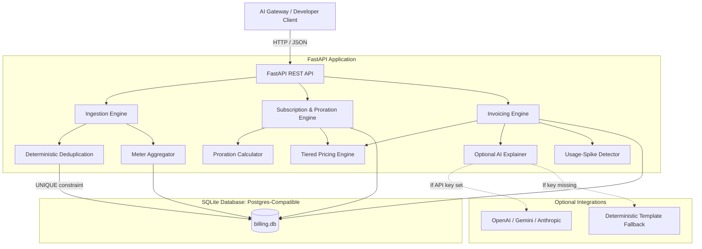

# Architecture & System Design: Core Billing Engine Rebuild

## 1. System Overview

The rebuild architecture replaces the distributed, multi-service upstream footprint (Go, PostgreSQL, ClickHouse, Redis, Kafka, Temporal) with a streamlined, zero-dependency engine built in **Python (FastAPI)** and **SQLite**.

The architecture prioritizes:
1. **Deterministic Idempotency**: Database-level unique constraints eliminate race-condition duplicates.
2. **Precision Accounting**: All monetary values are stored strictly as integer paise (1 INR = 100 paise).
3. **Deterministic Testing**: System time can be injected via `BILLING_NOW`, allowing 30-day billing cycles and mid-month plan changes to be simulated in milliseconds.
4. **Resilient Intelligence**: AI-powered invoice explanations and anomaly checks run with zero hard dependencies—if no LLM API key is present, the system defaults to deterministic template generation.

---

## 2. Component Diagram



---

## 3. Component Breakdown

### 1. Ingestion & Deduplication Engine
* **Responsibility**: Ingests usage events synchronously over HTTP.
* **Mechanism**: Verifies timestamp bounds, extracts metrics, and performs an atomic insert into the `usage_events` table.
* **Deduplication**: Enforced by SQLite `UNIQUE(tenant_id, event_id)`. If an identical ID arrives, the engine catches the constraint violation and returns an idempotent 200 OK without double-recording tokens.

### 2. Meter Aggregation Engine
* **Responsibility**: Groups and aggregates events across half-open time windows (`timestamp >= start AND timestamp < end`).
* **Supported Modes**: `SUM` (total tokens), `COUNT` (requests), and `COUNT_UNIQUE` (unique user IDs).
* **Unit Packaging**: Applies configured transformations (e.g., dividing raw tokens by 1,000) before handing counts to the pricing engine.

### 3. Tiered Pricing Engine
* **Responsibility**: Evaluates costs for billable units against configured tier structures.
* **Modes**:
  * **Volume Mode**: Assigns the entire consumption to a single matching tier bracket.
  * **Slab Mode (Graduated)**: Partitions consumption across progressive brackets; sums per-bracket unit costs and flat fees.
* **Inclusivity Rule**: `UpTo` boundary is strictly inclusive (`units <= UpTo`).

### 4. Subscription & Proration Engine
* **Responsibility**: Manages subscription lifecycles and mid-cycle plan changes.
* **Proration Logic**: Implements day-based and second-based coefficient calculations. Calculates unused credits on outgoing plans and prorated charges on incoming plans, producing opposing invoice line items.

### 5. Invoicing & Explainer Engine
* **Responsibility**: Assembles fixed subscription charges, metered usage charges, and proration adjustments into a sealed invoice.
* **Accounting**: Computes subtotal, total, and amount due in integer paise.
* **AI Explainer**: Produces natural-language bill summaries. If an AI key is absent, an in-memory rule-based template generates equivalent explanations.

---

## 4. Key Architectural Decisions

| Decision | Alternative Considered | Rationale |
| :--- | :--- | :--- |
| **Python 3.12 + FastAPI** | Go (original stack) | Allows rapid, clean implementation with full type hints (Pydantic), accessible to stranger agents while remaining highly performant for API operations. |
| **Single-File SQLite** | PostgreSQL + ClickHouse + Redis | Eliminates complex external infrastructure setup. SQLite handles transactional concurrency with WAL mode and runs tests instantly in memory or on disk. |
| **Money as Integer Paise** | Floating-point / Decimal strings | Floating-point math introduces rounding drift (e.g. `0.1 + 0.2 != 0.3`). Storing whole paise (1 INR = 100 paise) guarantees exact banking precision. |
| **Synchronous Ingestion** | Kafka broker fire-and-forget | Eliminates message loss when brokers fail. The client receives an immediate guarantee that usage has been durably committed before receiving HTTP 200/201. |
| **Deterministic Time Injection** | Hardcoded `datetime.now()` | Allows tests to simulate mid-month upgrades, period rollovers, and late events instantly without thread sleeps or system clock manipulation. |

---

## 5. Build Order for Implementation

To ensure Killer Tests pass first before secondary features are added, build the engine in this exact sequence:

1. **Phase 1: Foundation & Data Schema**
   * Setup SQLite database with tables for `customers`, `meters`, `plans`, `prices`, `price_tiers`, and `usage_events`.
   * Enforce `UNIQUE(tenant_id, event_id)` on `usage_events`.
2. **Phase 2: Killer Test 1 (Event Ingestion & Deduplication)**
   * Implement `POST /v1/events` route.
   * Implement synchronous insert with constraint violation handling.
   * Verify duplicate event is accepted but never double-recorded.
3. **Phase 3: Killer Test 3 (Meters & Tiered Pricing)**
   * Implement meter query engine (`SUM` of tokens divided by 1,000).
   * Implement Volume and Slab tier evaluation logic.
   * Verify hand-worked calculation matches exactly (1,500 units = ₹140.00 in Slab mode).
4. **Phase 4: Killer Test 2 (Subscriptions & Mid-Month Proration)**
   * Implement subscription management and plan upgrade route (`POST /v1/subscriptions/{id}/upgrade`).
   * Implement day-based proration coefficient and credit/charge math.
   * Implement invoice generation outputting opposing credit and debit lines.
   * Verify 15th-day upgrade yields exact ₹3,000 net due.
5. **Phase 5: Fixes & Production Hardening**
   * Add strict timestamp drift checking on event ingestion.
   * Add sub-paise micro-pricing support for fractional token rates.
6. **Phase 6: Differentiators**
   * Implement usage-spike velocity detection.
   * Implement AI plain-language invoice explainer with template fallback.

---

## 6. Directory Layout

```
rebuild/
├── app/
│   ├── api/
│   │   ├── routes/
│   │   │   ├── events.py
│   │   │   ├── meters.py
│   │   │   ├── plans.py
│   │   │   ├── prices.py
│   │   │   ├── customers.py
│   │   │   ├── subscriptions.py
│   │   │   └── invoices.py
│   │   └── router.py
│   ├── core/
│   │   ├── config.py
│   │   └── time.py
│   ├── db/
│   │   ├── database.py
│   │   └── models.py
│   ├── services/
│   │   ├── ingestion.py
│   │   ├── meter.py
│   │   ├── pricing.py
│   │   ├── proration.py
│   │   ├── invoice.py
│   │   ├── spike_detector.py
│   │   └── explainer.py
│   └── main.py
├── tests/
│   ├── test_killer_1_dedup.py
│   ├── test_killer_2_proration.py
│   └── test_killer_3_tiered.py
├── .env
├── requirements.txt
└── README.md
```

---

## 7. Environment Settings Reference

| Variable Name | Purpose | Default / Example |
| :--- | :--- | :--- |
| `DATABASE_URL` | SQLite database connection string | `sqlite:///./billing.db` |
| `BILLING_NOW` | Injectable ISO timestamp overriding system clock | `2026-10-01T00:00:00Z` (or empty for current time) |
| `BILLING_PERIOD_MINUTES` | Testing window override (allows minutes instead of months) | `0` (uses standard calendar days if 0) |
| `AI_PROVIDER_API_KEY` | Optional API key for LLM invoice explanations | `sk-...` (optional; falls back to template if empty) |
| `SPIKE_THRESHOLD_FACTOR` | Multiplier over moving average to flag runaway usage | `3.0` |
| `MAX_PAST_DRIFT_DAYS` | Maximum allowed age for historical usage event timestamps | `30` |
| `MAX_FUTURE_DRIFT_MINUTES`| Maximum allowed clock skew into the future for events | `5` |
