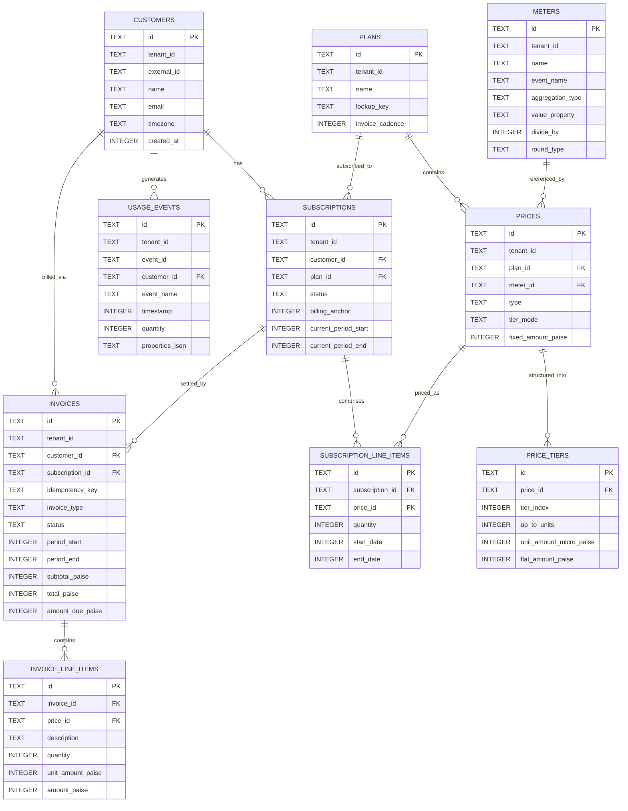

# Data Model & Schema Specification: Core Billing Engine

## 1. Overview & Money Accounting Principles

To ensure absolute financial consistency for Indian AI API workloads, the database schema adheres to two strict rules:
1. **Integer Paise Storage**: All monetary balances, plan rates, flat fees, invoice totals, and credit amounts are stored strictly as `INTEGER` values representing **paise** ($1\text{ INR} = 100\text{ paise}$). Floating-point currency columns are prohibited.
2. **Sub-Paise Micro-Token Rating**: Unit rates for micro-consumption (e.g., individual LLM tokens or prompt queries) are stored as `INTEGER` **micro-paise** ($1\text{ paise} = 10,000\text{ micro-paise}$, or $1\text{ INR} = 1,000,000\text{ micro-paise}$).
3. **Half-Up Rounding Rule**: When converting accumulated micro-paise into billable line item paise, the engine applies integer arithmetic half-up rounding:
   $$\text{AmountPaise} = \left\lfloor \frac{\text{MicroPaise} + 5,000}{10,000} \right\rfloor$$

---

## 2. Entity-Relationship Diagram

---

## 3. Database Schema & Table Definitions

### 1. `customers`
Stores customer records mapped to tenant and external references.
* `id` (`TEXT`, PRIMARY KEY): Unique identifier (e.g., `cust_101`).
* `tenant_id` (`TEXT`, NOT NULL): Multi-tenant partition key.
* `external_id` (`TEXT`, NOT NULL): Client-side unique external identifier.
* `name` (`TEXT`, NOT NULL): Customer business or individual name.
* `email` (`TEXT`): Customer contact email.
* `timezone` (`TEXT`, NOT NULL, DEFAULT `'UTC'`): IANA timezone string.
* `created_at` (`INTEGER`, NOT NULL): Unix epoch timestamp in seconds.
* **Constraints**:
  * `UNIQUE(tenant_id, external_id)`

### 2. `meters`
Defines how raw event properties are filtered, grouped, and scaled.
* `id` (`TEXT`, PRIMARY KEY): Meter identifier (e.g., `meter_tokens`).
* `tenant_id` (`TEXT`, NOT NULL): Multi-tenant partition key.
* `name` (`TEXT`, NOT NULL): Human-readable meter name.
* `event_name` (`TEXT`, NOT NULL): Matches `usage_events.event_name`.
* `aggregation_type` (`TEXT`, NOT NULL): One of `COUNT`, `SUM`, `COUNT_UNIQUE`.
* `value_property` (`TEXT`): Property key extracted from JSON (e.g., `total_tokens`).
* `divide_by` (`INTEGER`, NOT NULL, DEFAULT 1): Packaging divisor (e.g. 1,000 for per-thousand token billing).
* `round_type` (`TEXT`, NOT NULL, DEFAULT `'none'`): Rounding on transform (`up`, `down`, `none`).

### 3. `plans`
Defines recurring subscription catalog offerings.
* `id` (`TEXT`, PRIMARY KEY): Plan identifier (e.g., `plan_starter`, `plan_pro`).
* `tenant_id` (`TEXT`, NOT NULL): Multi-tenant partition key.
* `name` (`TEXT`, NOT NULL): Display name.
* `lookup_key` (`TEXT`, NOT NULL): Unique code for lookups.
* **Constraints**:
  * `UNIQUE(tenant_id, lookup_key)`

### 4. `prices` & `price_tiers`
Stores recurring base fees and metered tier structures.
* `prices` table:
  * `id` (`TEXT`, PRIMARY KEY): Price identifier.
  * `tenant_id` (`TEXT`, NOT NULL): Multi-tenant partition key.
  * `plan_id` (`TEXT`, REFERENCES `plans(id)`): Parent plan.
  * `meter_id` (`TEXT`, REFERENCES `meters(id)`): Attached meter (for usage prices).
  * `type` (`TEXT`, NOT NULL): `fixed` (subscription charge) or `usage` (metered).
  * `tier_mode` (`TEXT`): `volume` or `slab` (graduated).
  * `fixed_amount_paise` (`INTEGER`, DEFAULT 0): Base recurring fee in paise.
* `price_tiers` table:
  * `id` (`TEXT`, PRIMARY KEY): Tier row identifier.
  * `price_id` (`TEXT`, NOT NULL, REFERENCES `prices(id)`): Parent price record.
  * `tier_index` (`INTEGER`, NOT NULL): Sequential order index ($0, 1, 2, \dots$).
  * `up_to_units` (`INTEGER`): Upper inclusive bracket bound (NULL for final infinite tier).
  * `unit_amount_micro_paise` (`INTEGER`, NOT NULL): Micro-paise rate per unit.
  * `flat_amount_paise` (`INTEGER`, NOT NULL, DEFAULT 0): Flat fee for this bracket in paise.
  * **Constraints**:
    * `UNIQUE(price_id, tier_index)`

### 5. `subscriptions` & `subscription_line_items`
Tracks active customer subscriptions and versioned plan prices.
* `subscriptions` table:
  * `id` (`TEXT`, PRIMARY KEY): Subscription identifier (e.g., `sub_01`).
  * `tenant_id` (`TEXT`, NOT NULL): Multi-tenant partition key.
  * `customer_id` (`TEXT`, NOT NULL, REFERENCES `customers(id)`).
  * `plan_id` (`TEXT`, NOT NULL, REFERENCES `plans(id)`).
  * `status` (`TEXT`, NOT NULL): `active`, `cancelled`, `paused`.
  * `billing_anchor` (`INTEGER`, NOT NULL): Epoch seconds anchoring renewal cycles.
  * `current_period_start` (`INTEGER`, NOT NULL): Inclusive period start.
  * `current_period_end` (`INTEGER`, NOT NULL): Exclusive period end.
* `subscription_line_items` table:
  * `id` (`TEXT`, PRIMARY KEY): Line item identifier.
  * `subscription_id` (`TEXT`, NOT NULL, REFERENCES `subscriptions(id)`).
  * `price_id` (`TEXT`, NOT NULL, REFERENCES `prices(id)`).
  * `quantity` (`INTEGER`, NOT NULL, DEFAULT 1): Multiplier for fixed items.
  * `start_date` (`INTEGER`, NOT NULL): Timestamp when this item became effective.
  * `end_date` (`INTEGER`): Timestamp when terminated (set during plan upgrade).

### 6. `usage_events` (Deduplication Core)
Stores all raw ingested usage telemetry.
* `id` (`TEXT`, PRIMARY KEY): System auto-generated primary key.
* `tenant_id` (`TEXT`, NOT NULL): Multi-tenant partition key.
* `event_id` (`TEXT`, NOT NULL): Client-supplied idempotency identifier.
* `customer_id` (`TEXT`, NOT NULL, REFERENCES `customers(id)`).
* `event_name` (`TEXT`, NOT NULL): Matched against meter `event_name`.
* `timestamp` (`INTEGER`, NOT NULL): Epoch timestamp of event occurrence.
* `quantity` (`INTEGER`, NOT NULL): Raw property quantity (e.g., tokens consumed).
* `properties_json` (`TEXT`): Additional structured payload data.
* `ingested_at` (`INTEGER`, NOT NULL): Epoch timestamp when stored.
* **CRITICAL DEDUPLICATION CONSTRAINT**:
  * `UNIQUE(tenant_id, event_id)`
  * *Effect*: Any retry, duplicate post, or network re-send with the same `event_id` is caught at the database index layer.

### 7. `invoices` & `invoice_line_items`
Records finalized and draft billing statements.
* `invoices` table:
  * `id` (`TEXT`, PRIMARY KEY): Invoice identifier (e.g., `inv_001`).
  * `tenant_id` (`TEXT`, NOT NULL): Multi-tenant partition key.
  * `customer_id` (`TEXT`, NOT NULL, REFERENCES `customers(id)`).
  * `subscription_id` (`TEXT`, REFERENCES `subscriptions(id)`).
  * `idempotency_key` (`TEXT`, NOT NULL): Derived deterministic idempotency hash.
  * `invoice_type` (`TEXT`, NOT NULL): `subscription_cycle` or `one_off` (proration).
  * `status` (`TEXT`, NOT NULL): `draft`, `finalized`, `voided`.
  * `period_start` (`INTEGER`, NOT NULL): Billing interval start epoch.
  * `period_end` (`INTEGER`, NOT NULL): Billing interval end epoch.
  * `subtotal_paise` (`INTEGER`, NOT NULL): Sum of line items in paise.
  * `total_paise` (`INTEGER`, NOT NULL): Total after adjustments in paise.
  * `amount_due_paise` (`INTEGER`, NOT NULL): Outstanding amount due in paise.
  * `created_at` (`INTEGER`, NOT NULL): Epoch creation timestamp.
  * **Constraints**:
    * `UNIQUE(tenant_id, idempotency_key)`
    * `UNIQUE(subscription_id, period_start, period_end)`
* `invoice_line_items` table:
  * `id` (`TEXT`, PRIMARY KEY): Line item identifier.
  * `invoice_id` (`TEXT`, NOT NULL, REFERENCES `invoices(id)`).
  * `price_id` (`TEXT`, REFERENCES `prices(id)`).
  * `description` (`TEXT`, NOT NULL): Human-readable item summary.
  * `quantity` (`INTEGER`, NOT NULL): Units billed.
  * `unit_amount_paise` (`INTEGER`, NOT NULL): Cost per unit in paise.
  * `amount_paise` (`INTEGER`, NOT NULL): Total line charge or credit in paise.
  * `metadata_json` (`TEXT`): Audit data (tier breakdown, proration days).
